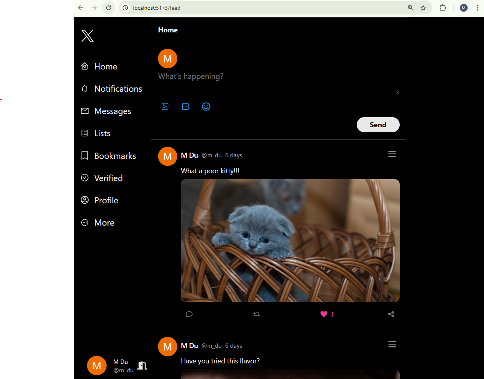
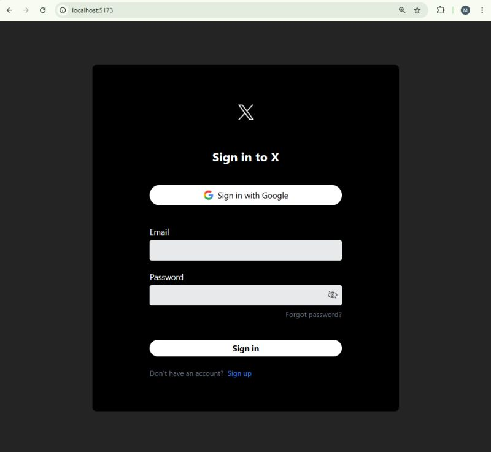

# X-clone Firebase Firestore project
In this project, Firebase Authentication and Redux Toolkit Thunk is used to create a smooth and efficient user experience.
🔹 Fast & Secure Login
Users can quickly log in using Google Authentication or email.
🔹 Seamless & Responsive User Experience
Redux Toolkit Thunk efficiently handles asynchronous operations, ensuring the UI remains smooth and responsive during API calls.
Once logged in, users stay authenticated even after refreshing the page thanks to persistent session management.
🔹 Real-Time Data Management
Firebase Firestore ensures real-time data synchronization, allowing users to see updates instantly.
Posts and interactions are updated in real time, enhancing engagement and responsiveness.
# 📌 Conclusion:
This project serves as a great example of how to optimize performance, security, and user experience in modern web applications. 🚀
# Preview of the project

